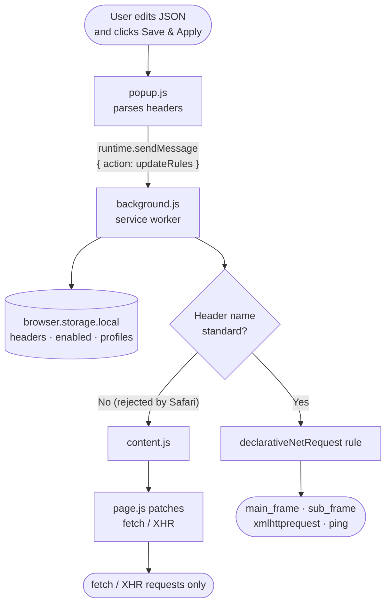

# HeaderX for Safari

A lightweight Safari extension for **macOS and iOS (iPhone/iPad)** that injects custom HTTP headers into web requests. Perfect for local development, testing APIs, and adding authentication tokens on the fly.

Safari ships web extensions inside a native app, so HeaderX is distributed as a signed macOS `.dmg` (and builds to iPhone/iPad from the same Xcode project) rather than an unpacked folder.

> Looking for Chrome? Chromium-based browsers are supported by a separate build — see **[nicechester/headerx](https://github.com/nicechester/headerx)**. (Safari's `declarativeNetRequest` only accepts standard header names, which is why it's a separate project.)

## Features

- 🔘 **On/off toggle** — Flip the switch in the popup header to enable or disable injection instantly
- 📋 **JSON-based configuration** — Define your headers as JSON in a single textarea
- ☑️ **List view** — Switch to a key/value list where each header has its own on/off checkbox
- 🌐 **Applies everywhere** — While turned on, headers are injected into requests to all URLs
- 📁 **Profiles** — Save named header sets and switch between them
- 🔒 **Persistent storage** — Settings survive browser restarts
- 🚀 **Declarative Net Request API** — Uses native browser APIs (MV3 compliant)

## Installation

### macOS

Download the latest `HeaderX.dmg` from the **[Releases page](https://github.com/nicechester/headerx-safari-macos/releases)**, then:

1. Open the downloaded `HeaderX.dmg` and drag **HeaderX.app** into your **Applications** folder.
2. Launch **HeaderX.app** once. On first launch macOS may warn that it's from an unidentified developer — if so, right-click the app and choose **Open**, or approve it in **System Settings → Privacy & Security**.
3. Open Safari and go to **Safari → Settings… (⌘,) → Extensions**.
4. Check the box next to **HeaderX** to enable it, and grant it access to web pages when prompted.
5. The **H** icon appears in the Safari toolbar. If it's hidden, right-click the toolbar → **Customize Toolbar…** and drag it into place.

> **If HeaderX doesn't appear or looks greyed out**, the build may be unsigned. Enable Safari's developer features under **Safari → Settings → Advanced → "Show features for web developers"**, then turn on **Develop → Allow Unsigned Extensions**. Note that this setting resets each time Safari restarts.

### iOS (iPhone/iPad)

The iOS app is built to your device from the shared Xcode project (see [Development](#development)):

1. Open `HeaderX/HeaderX.xcodeproj` in Xcode, select the **iOS** app target, and run it on a connected iPhone/iPad (or Simulator).
2. On the device, open **Settings → Apps → Safari → Extensions** (older iOS: **Settings → Safari → Extensions**) and turn **HeaderX** on.
3. Set its permissions to **Allow** for the sites you want (or **All Websites**).
4. In Safari, tap the **puzzle-piece / “aA”** menu in the address bar → **HeaderX** to open the popup and edit headers.

> A device build installed from Xcode is signed with a development profile that expires after 7 days (free Apple ID) — rebuild from Xcode when it lapses. A paid Apple Developer account extends this.

### Updating

Download the newer `HeaderX.dmg` from the Releases page and replace the copy in **Applications** (quit Safari first). Your saved headers and profiles are stored by Safari and carry over across updates.

## Usage

1. Open the **HeaderX** popup — click the toolbar icon on macOS, or tap the address-bar **puzzle-piece / “aA”** menu → **HeaderX** on iOS
2. Enter your headers as JSON in the textarea. Two formats are accepted:

   ```json
   [
     { "name": "X-Custom-Header", "value": "value" },
     { "name": "Authorization", "value": "Bearer token" }
   ]
   ```

   ```json
   {
     "X-Custom-Header": "value",
     "Authorization": "Bearer token"
   }
   ```

3. Click **Save & Apply**
4. Flip the **toggle** in the top-right corner to turn injection on or off

While the toggle is **on**, the saved headers are injected into every request. While **off**, nothing is injected — your JSON stays saved for next time.

### List View

Use the **JSON / List** switcher above the editor to change display modes:

- **JSON** — edit headers as raw JSON text
- **List** — see each header as a row with a checkbox to turn that individual header on or off; checkbox changes save and apply immediately

In the array JSON format, each entry may carry an optional `"enabled"` flag (defaults to `true` when omitted):

```json
[
  { "name": "X-Custom-Header", "value": "value" },
  { "name": "Authorization", "value": "Bearer token", "enabled": false }
]
```

A header stays saved while unchecked — it just isn't injected until you check it again.

### Profiles

Save the current JSON as a named set and reuse it later:

- **Save** — type a profile name and click **Save Profile** (selecting an existing profile and clicking Save Profile overwrites it)
- **Load** — pick a profile from the dropdown, click **Load**, then **Save & Apply** to activate
- **Delete** — pick a profile and click **Delete**

## File Structure

```
headerx-safari/
├── manifest.json      # Extension configuration (MV3)
├── background.js      # Service worker that applies rules
├── popup.html         # Popup UI
├── popup.js           # Popup UI logic
├── content.js         # Content script (relays headers to the page)
├── page.js            # In-page injection for non-standard headers
├── icons/             # Extension icons
├── HeaderX/           # Native macOS/iOS app wrapper (Xcode project)
└── README.md          # This file
```

## How It Works

1. The popup parses your JSON and sends it to the background service worker
2. The service worker stores it in `browser.storage.local` and uses Safari's **declarativeNetRequest API** to register a header-injection rule
3. Safari's `declarativeNetRequest` only accepts **standard** header names. Any header it rejects is instead injected in-page via `content.js` / `page.js`, which patches `fetch`/`XHR` (so those headers reach `fetch`/`XHR` requests only, not top-level navigations)
4. The toggle simply adds or removes the rules — headers and profiles stay saved either way
5. Rules are restored on browser startup



### Message Format (popup → background)

```javascript
{
  action: "updateRules",
  headers: [
    { name: "Authorization", value: "Bearer token" },
    { name: "X-Custom-Header", value: "custom-value" }
  ],
  enabled: true
}
```

## Limitations

- Headers apply to **all URLs** while enabled — be careful with sensitive headers like `Authorization`, since they'll be sent to every site you visit
- **Standard** header names are applied to main frames, subframes, XHR, and ping requests via `declarativeNetRequest`
- **Non-standard** header names (which Safari's `declarativeNetRequest` rejects) are injected in-page and therefore reach `fetch`/`XHR` requests only — not top-level page navigations

## Troubleshooting

**Headers not being applied:**
- Check that the toggle in the top-right corner is turned **on**
- Make sure you clicked **Save & Apply** after editing the JSON
- Verify HeaderX is enabled under **Safari → Settings → Extensions**
- If the build is unsigned, confirm **Develop → Allow Unsigned Extensions** is still on (it resets when Safari restarts)

**Invalid JSON errors:**
- The textarea must contain a JSON array of `{"name": ..., "value": ...}` objects or a plain `{"Header": "value"}` map
- Each header needs a non-empty name and a value

## Development

Safari loads the extension from the native app bundle, so changes are picked up by rebuilding in Xcode:

1. Open `HeaderX/HeaderX.xcodeproj` in Xcode
2. Edit the extension resources (`popup.html`, `popup.js`, `background.js`, `content.js`, `page.js`)
3. Build & run the **HeaderX** app target (⌘R) to reinstall the extension
4. In Safari, enable **Develop → Allow Unsigned Extensions** (resets each restart), then toggle HeaderX off/on under **Settings → Extensions** to load the new build

## License

MIT — Free to use and modify.
